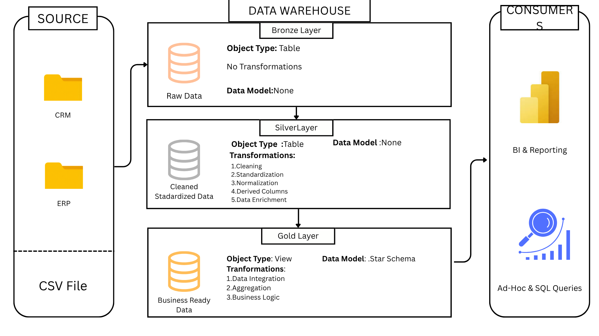
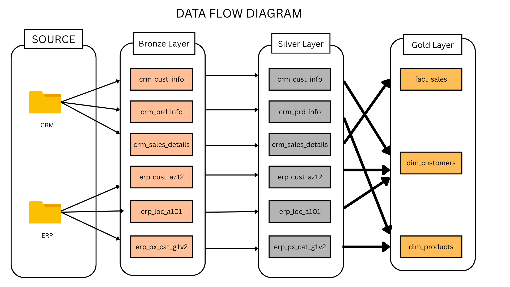
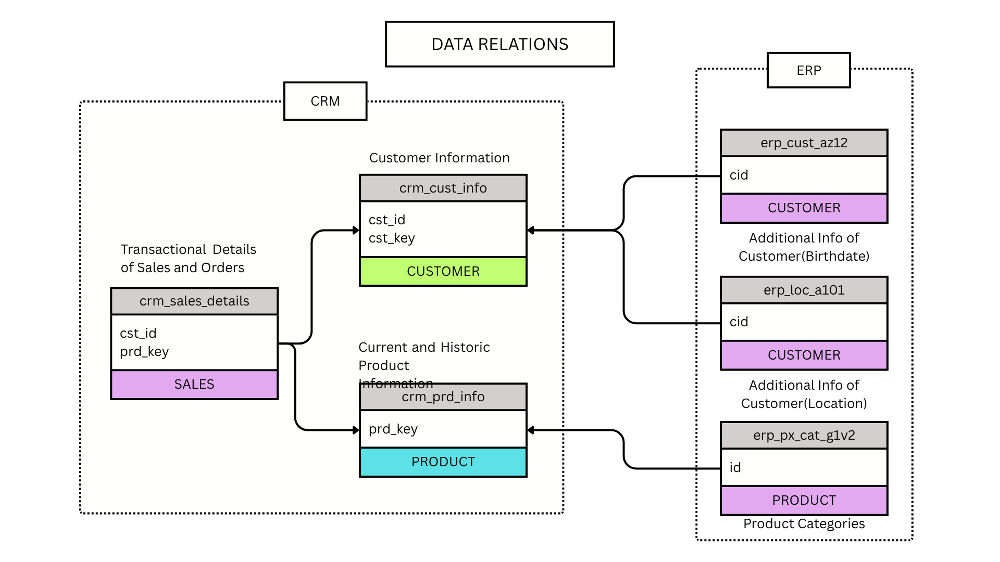

# 🏗️ Data Warehouse Project

A modern data warehouse built using the **Medallion Architecture** (Bronze, Silver, Gold layers) in SQL Server. This project consolidates sales data from two source systems — **CRM** and **ERP** — into a clean, business-ready **Star Schema** for analytics, BI reporting, and ad-hoc SQL queries.

---

## 📖 Table of Contents

- [Overview](#-overview)
- [Architecture](#-architecture)
- [Data Flow](#-data-flow)
- [Data Sources](#-data-sources)
- [Data Model (Star Schema)](#-data-model-star-schema)
- [Repository Structure](#-repository-structure)
- [How to Run](#-how-to-run)

---

## 🎯 Overview

This project simulates a real-world data warehousing pipeline where raw CSV extracts from **CRM** and **ERP** systems are ingested, cleaned, standardized, and modeled into a **star schema** for reporting and analysis. It follows the **Bronze → Silver → Gold** medallion pattern, a widely adopted approach for building scalable, maintainable data warehouses.

**Objectives:**
- Ingest raw CRM & ERP data (CSV files) with zero transformation into the **Bronze Layer**.
- Clean, standardize, normalize, and enrich the data in the **Silver Layer**.
- Integrate and model business-ready data into a **Star Schema** in the **Gold Layer**.
- Enable downstream consumption via **BI & Reporting tools** and **Ad-Hoc SQL queries**.

---

## 🏛️ Architecture

The warehouse follows a three-layer medallion architecture:

| Layer  | Object Type | Data Model  | Transformations |
|--------|-------------|-------------|------------------|
| **Bronze** | Table | None | No transformations — raw data as-is |
| **Silver** | Table | None | Cleaning, Standardization, Normalization, Derived Columns, Data Enrichment |
| **Gold**   | View  | Star Schema | Data Integration, Aggregation, Business Logic |



- **Bronze Layer** — Stores raw, unaltered data ingested directly from source CSV files (CRM & ERP).
- **Silver Layer** — Applies data cleansing and standardization rules to prepare data for integration.
- **Gold Layer** — Exposes business-ready views modeled as a star schema, consumed by BI tools and analysts.

---

## 🔄 Data Flow

Data flows from source systems through each layer, with tables renamed/restructured at the Gold layer into fact and dimension objects.



**Flow summary:**
1. `CRM` and `ERP` source folders feed six raw tables into the **Bronze Layer**:
   `crm_cust_info`, `crm_prd_info`, `crm_sales_details`, `erp_cust_az12`, `erp_loc_a101`, `erp_px_cat_g1v2`
2. These tables pass through to the **Silver Layer** with the same structure, now cleaned and standardized.
3. The Silver tables are integrated and modeled into three **Gold Layer** objects:
   `fact_sales`, `dim_customers`, `dim_products`

---

## 🔗 Data Sources

Two source systems feed the warehouse, each contributing customer, product, and sales information.



### CRM
| Table | Description | Key |
|---|---|---|
| `crm_cust_info` | Customer information | `cst_id`, `cst_key` |
| `crm_prd_info` | Current and historic product information | `prd_key` |
| `crm_sales_details` | Transactional details of sales and orders | `cst_id`, `prd_key` |

### ERP
| Table | Description | Key |
|---|---|---|
| `erp_cust_az12` | Additional customer info (birthdate) | `cid` |
| `erp_loc_a101` | Additional customer info (location) | `cid` |
| `erp_px_cat_g1v2` | Product categories | `id` |

---

## ⭐ Data Model (Star Schema)

The Gold layer exposes a classic star schema with one fact table surrounded by two dimension tables.


- **`fact_sales`** — Grain: one row per sales order line (`order_number`, `order_date`, `sales_amount`, `quantity`, `price`), linked to dimensions via `customer_key` and `product_key`.
- **`dim_customers`** — Customer attributes: name, country, marital status, gender, birth date, etc.
- **`dim_products`** — Product attributes: category, subcategory, cost, product line, start date, etc.

---

## 📂 Repository Structure

```
data-warehouse-project/
│
├── Datasets/                      # Raw source CSV files
│   ├── CRM/
│   │   ├── cust_info.csv
│   │   ├── prd_info.csv
│   │   └── sales_details.csv
│   └── ERP/
│       ├── CUST_AZ12.csv
│       ├── LOC_A101.csv
│       └── PX_CAT_G1V2.csv
│
├── Docs/                          # Architecture & design diagrams
│   ├── data_flow_diagram.png
│   ├── data_relations.png
│   ├── star_schema.png
│   └── warehouse_architecture.png
│
├── Scripts/                       # SQL scripts for the ETL pipeline
│   ├── init_database.sql          # Creates the database and schemas
│   ├── Bronze/
│   │   ├── ddl_bronze_crm.sql     # DDL for CRM bronze tables
│   │   ├── ddl_bronze_erp.sql     # DDL for ERP bronze tables
│   │   └── proc_load_bronze.sql   # Stored procedure to load bronze layer
│   ├── Silver/
│   │   ├── ddl_silver_crm.sql     # DDL for CRM silver tables
│   │   ├── ddl_silver_erp.sql     # DDL for ERP silver tables
│   │   └── proc_load_silver.sql   # Stored procedure to load silver layer
│   └── Gold/
│       └── ddl_gold.sql           # Views for fact_sales, dim_customers, dim_products
│
├── Tests/                         # Data quality & validation scripts
│   ├── bronze_test.sql
│   └── gold_test.sql
│
└── README.md
```

---

## 🚀 How to Run

1. **Initialize the database**
   Run `Scripts/init_database.sql` to create the data warehouse database and its schemas (`bronze`, `silver`, `gold`).

2. **Build the Bronze Layer**
   - Execute `Scripts/Bronze/ddl_bronze_crm.sql` and `Scripts/Bronze/ddl_bronze_erp.sql` to create the raw tables.
   - Run `Scripts/Bronze/proc_load_bronze.sql` to bulk-load the CSV files from `Datasets/` into the Bronze tables.

3. **Build the Silver Layer**
   - Execute `Scripts/Silver/ddl_silver_crm.sql` and `Scripts/Silver/ddl_silver_erp.sql` to create the cleaned tables.
   - Run `Scripts/Silver/proc_load_silver.sql` to transform and load data from Bronze into Silver.

4. **Build the Gold Layer**
   - Execute `Scripts/Gold/ddl_gold.sql` to create the `fact_sales`, `dim_customers`, and `dim_products` views.

5. **Query the warehouse**
   - Connect your BI tool (e.g., Power BI) or run ad-hoc SQL queries directly against the Gold layer views.

---
